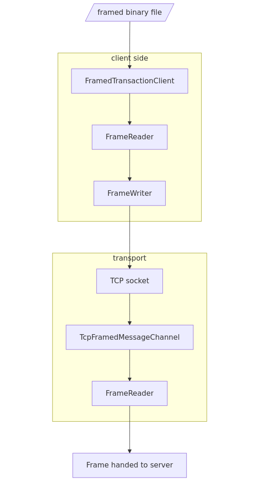
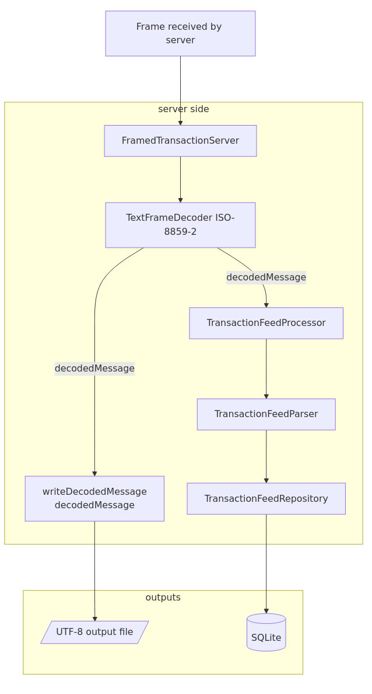

# Design Note

## System Shape

<table align="center">
<tr>
<td align="center" valign="top" width="50%">

</td>
<td align="center" valign="top" width="50%">

</td>
</tr>
</table>

## Decisions

| Area | Decision |
| --- | --- |
| Framing | 2-byte unsigned big-endian payload length |
| Payload bounds | 1..4096 bytes |
| Wire encoding | ISO-8859-2 payload bytes |
| Output encoding | UTF-8 text file |
| Ordering | Sequential receive path |
| Persistence | Raw decoded message plus split transaction columns |
| Database setup | Schema initialized on server startup |
| Invalid frames | Rejected before processing |
| Invalid transactions | Written to the decoded output file, then rejected from database persistence without closing the stream |

## Assumptions

| Area | Assumption |
| --- | --- |
| Transport | TCP provides ordered delivery |
| Server concurrency | Sequential handling is sufficient |
| Replies | Client acknowledgements are not required |
| Sentinels | `END` and `KRAJ` are non-transaction markers |
| Database | SQLite is acceptable for local review |

## Tradeoffs

| Choice | Rationale |
| --- | --- |
| Sequential server | Preserves receive order with minimal coordination |
| JDBC without ORM | Keeps SQL and schema behavior explicit |
| Raw plus split columns | Supports audit and structured queries |
| File truncates per server run | Produces a clean flat-file result |
| Database appends rows | Preserves persisted receive history |
| Sentinels as rows | Keeps end-of-feed markers in the same receive-order audit trail as transactions |
| One connection per insert | Keeps JDBC lifecycle simple for assignment-sized input; pooling would be added only for higher throughput |

## Operational Boundaries

| Area | Boundary |
| --- | --- |
| Concurrency | The server processes one client stream sequentially to preserve receive order without extra coordination. |
| Stalled clients | Accepted client sockets use a 5-second read timeout; a client that stops mid-frame is rejected and the server returns to accepting clients. |
| Persistence atomicity | Each SQLite insert is atomic, but the decoded output file and database are not one shared transaction. |
| Output contract | The UTF-8 file records successfully decoded frames; the database stores only valid parsed transaction feed messages. |
| File ahead of database | If a file write succeeds and parsing or persistence then fails, the decoded file can contain a line with no matching database row. |
| Failure recovery | Invalid transactions remain in the decoded output file, are rejected from the database, and do not close the client stream. |
| Restart behavior | The output file is truncated per server run, while the database continues `received_order` from the highest persisted value. |
| Shutdown | A JVM shutdown hook closes the TCP channel on normal termination, such as `Ctrl+C`. |
| Scaling | Higher throughput, backpressure, retries, and multi-client concurrency are production hardening outside the assignment scope. |

## Coverage

| Required area | Covered by |
| --- | --- |
| Frame parsing rules | `FrameReader` |
| Client file-to-TCP flow | `FramedTransactionClient` |
| Server TCP receive flow | `FramedTransactionServer` |
| ISO-8859-2 to UTF-8 | `TextFrameDecoder` |
| Flat file output | `FramedTransactionServer` |
| Database table definition | `schema.sql` |
| Split database columns | `TransactionFeedParser`, `TransactionFeedRepository` |
| Frame unit tests | `FrameReaderTest` |
| Client-server integration test | `ClientServerIntegrationTest` |
